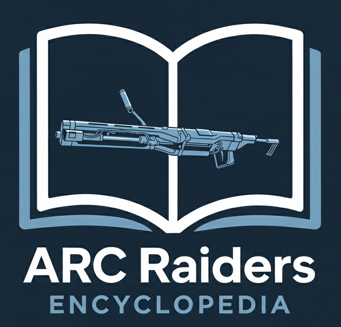

<p align="center"></p>

# ARC Raiders Encyclopedia

<p align="center">
  Fan-made item database built with Laravel, React, and Vite
</p>

<p align="center">
  
  
  
  
  
</p>


## 📖 About the Project

**ARC Raiders Encyclopedia** is a fan-made web application created by an enthusiast. This project is a non-commercial hobby initiative and is not officially affiliated with any game, publisher, or brand.

Users can browse the item database without logging in. Public access allows viewing item details such as rarity, item type, and locations where the item can be found. Each item also includes information about its components — what it can be dismantled into and which other items require those components.

Authenticated users have extended permissions. In addition to browsing items, they can create new entries, edit existing ones, and remove items from the database.

The application also supports importing a base item list from an external API, enabling fast and easy initial data population.

---

## 📖 O projekcie

**ARC Raiders Encyclopedia** to fanowska aplikacja webowa stworzona przez pasjonata. Projekt ma charakter hobbystyczny i nie jest oficjalnie powiązany z żadną grą, wydawcą ani marką.

Użytkownicy bez logowania mogą przeglądać bazę przedmiotów oraz sprawdzać szczegóły takie jak rzadkość, typ przedmiotu oraz miejsca jego występowania. Każdy przedmiot zawiera również informacje o tym, na jakie części można go rozłożyć oraz do jakich innych przedmiotów te części są wykorzystywane.

Zalogowani użytkownicy posiadają rozszerzone uprawnienia — poza przeglądaniem danych mogą tworzyć nowe przedmioty, edytować istniejące oraz usuwać wpisy z bazy.

Aplikacja umożliwia także pobranie podstawowej listy przedmiotów z zewnętrznego API, co pozwala szybko zainicjalizować bazę danych.

## 🚀 Getting Started

### Requirements
- PHP 8.2+
- Composer
- Node.js 18+
- MySQL

### Installation
Clone the repository:
```bash
git clone https://github.com/Angron-dev/arc_raiders_item_app-in-progress.git
cd arc_raiders_item_app-in-progress
```

Install dependencies:
```bash
composer install
```
```bash
npm install
```
```bash
npm run dev
```
```bash 
cp .env.example .env
php artisan key:generate
```
```bash
php artisan migrate
```

Download items form external API
```bash 
php artisan items:update
```

## Run the project
### Backend
```bash
php artisan serve
```

### Frontend
```bash
npm run dev
```

## Features

- CRUD for items
- Filter and search items
- User authentication
- Responsive UI built with React

## 🧪 Testing

```bash
php artisan test
```
---

## 🛣️ Roadmap

- [x] Item browsing
- [x] Item details view
- [x] External API import
- [ ] Advanced filtering and search
- [ ] Item comments system
- [ ] User roles & permissions
- [ ] Favorites / bookmarks
- [ ] Public API documentation
- [ ] Advanced CMS for site customization (colors, logos, visual settings)


## Author

WK - [GitHub](https://github.com/Angron-dev)

## License

This project is licensed under the MIT License.

